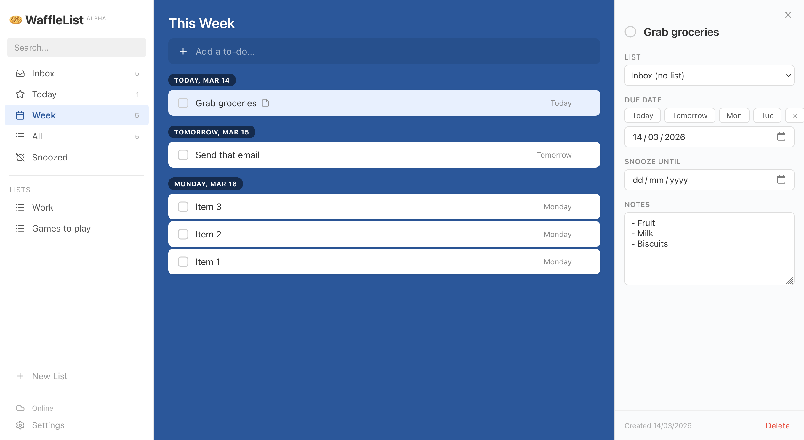

# Wafflelist

Wafflelist is a to-do list application with a focus on speed of use, simplicity and doing the basics really, really well. Its UI/UX is heavily inspired by Wunderlist. It is self-hostable, end-to-end-encrypted, works offline and seamlessly handles multi-device sync without user accounts.

[You can try it out here!](https://wafflelist.mxbi.net) (In alpha, **your data may be lost**)

## Features

- To-dos with due dates, multiple views, lists, and notes.
- Snoozing to-dos makes them disappear until you can do them (perfect for email follow-up reminders)
- **Extremely lightweight:** 200KB on first load, <10KB after that.
- **End-to-end encryption** means no one but you can see your data.
- **No accounts.** Your seed phrase is your username/password
- **Seamless offline support.** Once you've visited the site, you can now use it without an internet connection. Changes propagate when online.
- **Multi-device sync.** Just use the same seed phrase on each device.
- Adjustable backgrounds

## Security Architecture

> [!WARNING]
> Please note that this is a hobby project and thus the encryption architecture has not been independently reviewed. As such, it may have vulnerabilities, so you may wish to self-host the site if you are security-conscious. We always welcome security review.

**Seed phrase:** When you create a new vault, a random BIP39 12-word mnemonic is generated (128-bit entropy). The phrase never leaves the client.

**Key derivation** — three keys are derived from the seed and remain on the client.

| Key | Algorithm | Salt | Output |
|-----|-----------|------|--------|
| User ID | PBKDF2-SHA256 (600k iterations) | `wafflelist-user-id-v1` | 256-bit hex identifier |
| Encryption key | HKDF-SHA256 | `wafflelist-encryption-v1` | 256-bit AES-GCM key |
| Signing key | HKDF-SHA256 | `wafflelist-signing-v1` | Ed25519 private key |

**Data encryption:** AES-256-GCM with a random 96-bit IV per operation. All todo and list fields (except `id` and `user_id`) are encrypted client-side into a single `encrypted_blob` before being sent to the server. The server stores only ciphertext and does not have the key.

**Request authentication:** Every API request is signed with Ed25519. The server verifies the signature against the user's stored public key and rejects timestamps older than 30 seconds (replay protection).

**Implementation:** All crypto uses the browser's native Web Crypto API (`crypto.subtle`) - no external libraries. Keys are stored as non-extractable `CryptoKey` objects in IndexedDB.

## Contributing

Please feel free to submit issues or PRs! Before embarking on a lot of work, please open an issue to discuss what you wish to add.

Note that the philosophy of this project is to keep it simple and lightweight, so not all features may be suitable.

AI assistance is allowed, but **you must have read, understood and tested the code first.** Fully automated PRs cannot be considered.
